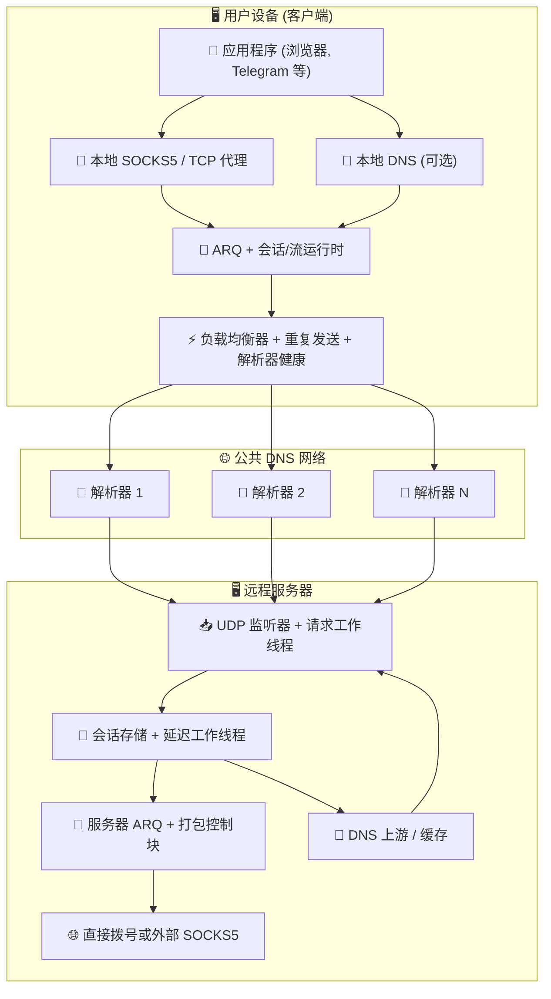
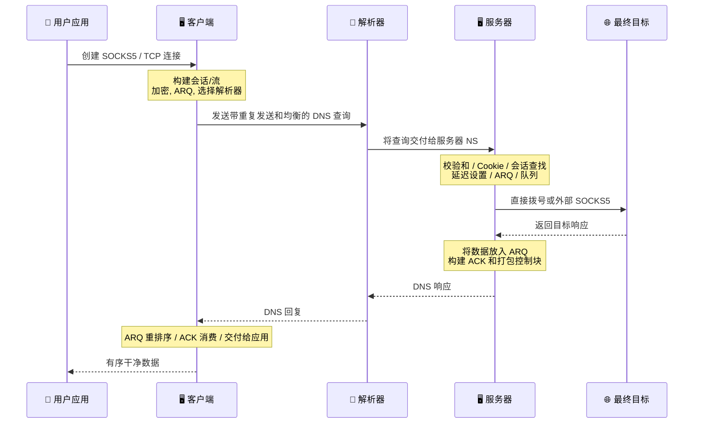

# MasterDnsVPN 项目 🔐

## | [نسخه فارسی](https://github.com/masterking32/MasterDnsVPN/blob/main/README_FA.MD) | [English Version](https://github.com/masterking32/MasterDnsVPN/blob/main/README.MD) | [Русская версия](https://github.com/masterking32/MasterDnsVPN/blob/main/README_RU.MD) |

**MasterDnsVPN** 是一个科学研究和实验性质的项目，用于通过 DNS 查询和响应来承载 TCP 流量。从广义目标来看，它与 DNSTT 或 SlipStream 等项目类似，但采用了根本不同的结构和实现方式。
该系统围绕与多种解析器行为的兼容性和恶劣网络条件而设计，目标是在最坏的情况下仍保持尽可能高的稳定性和数据传输能力。


[](https://deepwiki.com/masterking32/MasterDnsVPN) [](https://oosmetrics.com/repo/masterking32/MasterDnsVPN)

<a href="https://trendshift.io/repositories/23688" target="_blank"></a>

### 📊 MasterDnsVPN 与类似项目的对比

| 特性 | SlipStream | DNSTT | MasterDnsVPN |
| :--- | :--- | :--- | :--- |
| 协议类型 | 高级 DNS 隧道 | 经典 DNS 隧道 | 高级 DNS 隧道 / VPN |
| 传输协议 | QUIC | KCP + Noise | 自定义协议 + ARQ |
| 传输头开销 | 🟠 ~24B | 🔴 ~59B | 🟢 ~5–7B<br>比 DNSTT 低约 88%<br>比 SlipStream 低约 71% |
| 加密方式 | TLS 1.3 (在 QUIC 内部) | Noise (Curve25519) | AES / ChaCha20 / XOR (如果使用 XOR：轻量级，安全性较低，无额外开销) |
| 架构 | 统一 (QUIC 处理一切) | 多层 (KCP + SMUX + Noise) | 🟢 为 DNS 优化的轻量级自定义设计 |
| 速度 | 🟡 高 (比 DNSTT 快约 5 倍) | 🔴 中等 | 🟢 比其他项目更快<br>比 DNSTT 快约 9 倍<br>比 SlipStream 快约 3.6 倍 |
| 丢包下的稳定性 | 🟡 良好 | 🟠 中等 | 🟢 非常高 (多路径 + ARQ) |
| 多解析器支持 | 是 (多路径) | ❌ | 是 — 高级 (多解析器 + 重复发送) |
| 重度审查下的韧性 | 良好 | 中等 | 非常强 (核心项目目标) |
| 设置复杂度 | 中等 | 简单 | 安装更简单<br>只有在大量自定义高级设置时才会更复杂 |
| SOCKS5 支持 | 是 | 是 | 针对 SOCKS5 / SOCKS4 优化，减少了 SOCKS 开销 |
| Shadowsocks 支持 | ✅ | ❌ | 间接支持：TCP 转发模式可以承载基于 TCP 的协议<br>例如 Shadowsocks、VLESS/VMess 等 |
| 真正的多路径 | 是 (QUIC 多路径) | ❌ | 是 (多解析器 + 重复发送) |
| 自适应路由 | 有限 | ❌ | 高级 (基于延迟/丢包) |
| 设计目标 | 高速和高效 | 简单和稳定 | 在最恶劣的网络中生存 — 稳定、速度和效率 |
| 实现语言 | Rust | Go | 主版本为 Go<br>也存在旧版 Python 版本 |
| 内置负载均衡器 | 🔴 | ❌ | 🟢 (8 种内置均衡模式) |
| 重复发送系统 | ❌ | ❌ | 是 — 增加流量以提高可靠性 (可配置或禁用) |
| MTU 容忍度 | 比 DNSTT 更好 | - | 即使 MTU 非常小也能工作，因为协议开销非常低 |
| 故障转移系统 | ❌ | ❌ | ✅ |
| 下载速度 10MB (本地) | 🟡 0.978秒 | 🔴 2.492秒 | 🟢 0.270秒 |
| 上传速度 10MB (本地) | 🟡 3.249秒 | 🔴 16.207秒 | 🟢 1.746秒 |
| 解析器健康检查和自动禁用 | ❌ | ❌ | ✅ |
| 健康解析器的后台重新激活 | ❌ | ❌ | ✅ |
| 客户端本地 DNS 服务 (减少 DNS 劫持) | ❌ | ❌ | ✅ (带强大的 DNS 缓存) |
| 通过 SOCKS5 解析 DNS | ❌ | ❌ | ✅ (带 DNS 缓存) |
| 细粒度的专业配置 | 🟠 | 🟠 | 🟢 几乎每个子系统都可配置 |
| 无需外部辅助软件 | ❌ | ❌ | 🟢 不需要额外软件；如有需要，仍可与 SOCKS 或 Shadowsocks、OpenVPN 等工具结合使用 |

---

### ❌ 免责声明

MasterDnsVPN 仅作为教育和研究项目提供。

- **不提供担保：** 本软件按"原样"提供，不附带任何明示或暗示的担保，包括适销性、特定用途适用性或非侵权性。
- **责任限制：** 本项目的开发者和贡献者对因使用或无法使用本软件而产生的任何直接、间接、附带、后果性或其他损害不承担责任。
- **用户责任：** 在测试环境之外使用本项目可能会破坏或损坏网络行为。用户独自承担安装、配置和使用的所有后果。
- **法律合规：** 使用本项目绕过当地法律可能会导致民事或刑事后果。使用前请查看您所在国家的法律法规。开发者对用户违反当地、国家或国际法律的行为不承担责任。
- **许可条款：** 本软件的使用、复制、分发或修改受本仓库 `LICENSE` 文件中许可条款的约束。超出这些条款的任何使用均被禁止。

---

## 公告和支持频道 📢

获取最新新闻、版本发布和项目更新，请关注我们的 Telegram 频道：[Telegram 频道](https://t.me/masterdnsvpn)

---

### 如果您喜欢这个项目，请在 GitHub 上给它加星 (⭐) 以支持它。这有助于项目被发现。

---

### 可选的财务支持 💸

- TON 网络：

`masterking32.ton`

- EVM 兼容网络 (ETH 及兼容链)：

`0x517f07305D6ED781A089322B6cD93d1461bF8652`

- TRC20 网络 (TRON)：

`TLApdY8APWkFHHoxebxGY8JhMeChiETqFH`

每一份贡献和每一条反馈都值得感谢。支持直接有助于持续的开发和改进。

---

## 主要特性和优势 ✨

MasterDnsVPN 主要功能的简要概述：

- **抗审查和恶劣网络生存能力：** 🛡️ 专为在过滤网络、不稳定链路和严格 MTU 环境下工作而设计。
- **轻量级自定义协议：** 🔄 使用带有重传逻辑的自定义协议来减少开销并增加可用 DNS 负载。
- **多路径和数据包重复发送：** 📡 通过多条路径发送流量，并支持选择性重复发送以提高不稳定网络上的交付概率。
- **智能解析器选择和健康检查：** ⚡ 根据质量和健康状况选择解析器，并自动管理有问题的解析器。
- **MTU 发现和同步：** 🧰 检测工作路径的实际 MTU 并围绕其对齐，以减少碎片并提高稳定性。
- **SOCKS5 / SOCKS4 支持和优化：** 🧦 针对常见应用程序优化本地代理处理。
- **打包控制块和更低的控制开销：** 📦 将 ACK/控制流量分组在一起以减少控制 chatter。
- **可选压缩和请求打包：** 🗜️ 在小 MTU 条件下减少请求数量并提高效率。
- **灵活的加密：** 🔐 支持多种加密方法以平衡速度和安全性。
- **可选的客户端本地 DNS 和缓存：** 📛 可以暴露本地 DNS 服务，减少延迟并限制劫持机会。
- **可扩展的资源控制：** ⚙️ 可以在小型服务器上运行，也可以针对更重的负载进行调整。

此列表仅为高级摘要。下面的相关部分对每个领域进行了更详细的解释。

---

## 🌐 在全面互联网 blackout 中经过实战测试

MasterDnsVPN 不仅仅是一个理论项目。它经过实战测试，并证明在全球互联网完全切断的环境中也能工作。

最近，在伊朗 88 天的互联网 blackout 期间，当局不仅封锁了 VPN 或过滤了网站 — 他们完全切断了国际带宽。与外部世界 99% 的连接被物理切断，用户被困在一个封闭的本地内网中。

当没有国际互联网可连接时，标准的规避工具毫无用处。然而，在这场大规模 shutdown 期间，MasterDnsVPN 脱颖而出，成为实际上让用户保持与全球网络连接的极少数生命线之一。

**它是如何在全面 shutdown 中生存的？**
MasterDnsVPN 不像标准 VPN 那样运作，而是依靠智能 DNS 隧道技术穿透 blackout：
* **多个解析器：** 它通过各种 DNS 解析器路由流量，确保连接从不依赖单一、易于封锁的路径。
* **加密和数据拆分：** 它加密您的数据并将其分解成微小的、分散的片段。
* **伪装成合法流量：** 它将这些数据片段包装在标准的、完全正常的 DNS 查询中。
* **绕过本地陷阱：** 因为流量看起来完全像基本的日常 DNS 请求，防火墙允许它通过。数据被解析并到达外部世界 — 即使网络强迫您使用他们自己受限制的、政府控制的本地解析器。

正是这种组合让 MasterDnsVPN 在外部世界完全被封锁时保持了稳定的连接。

---

# 设置和入门 🧑‍💻

## 第一节：🖥️ 服务器设置

### 第一节.1：🌐 域名设置和准备 (先决条件)

要直接在服务器上接收 DNS 请求，您必须将子域名委派给它。简而言之，创建两条记录：一条指向服务器 IP 的 `A` 记录，和一条将隧道子域名委派给该 A 记录的 `NS` 记录。

#### 步骤 1.1.1：🅰️ 创建 A 记录 (服务器地址)

- **类型：** `A`
- **名称：** 一个短名称，例如 `ns`
- **值：** 您的服务器 IPv4 地址

> 示例：`ns.example.com -> 1.2.3.4`

> Cloudflare 注意：如果域名使用 Cloudflare，打开 `DNS` 页面并点击 `A` 记录旁边的云图标使其变为灰色 (`仅 DNS`)。它不能保持代理状态。

#### 步骤 1.1.2：🏷️ 创建 NS 记录 (委派子域名)

- **类型：** `NS`
- **名称：** 隧道子域名，例如 `v`
- **值 / 目标：** `ns.example.com`

> 示例：`v.example.com -> ns.example.com`

> Cloudflare 注意：正常添加 `NS` 记录。Cloudflare 不代理 NS 记录，但请确保 `ns` A 记录已设置为 `仅 DNS`。

#### 第一节.1.3：💡 关于 MTU 的简短说明

较短的域名在每个 DNS 请求中留下更多空间用于实际数据。为了获得更好的吞吐量，请保持名称简短。如果您使用 Cloudflare，仍请将相关记录保持在 `仅 DNS` 模式。

---

### 第一节.2：🐧 快速 Linux 服务器安装

#### 步骤 1.2.1：自动安装 (脚本)

如果您想在 Linux 上部署服务器，最简单的方法是自动安装脚本。在服务器上运行此命令：

```bash
bash <(curl -Ls https://raw.githubusercontent.com/masterking32/MasterDnsVPN/main/server_linux_install.sh)
```

该脚本自动处理安装和配置。完成后，服务器启动，**加密密钥** 会显示在终端日志中，并写入到可执行文件旁边的 `encrypt_key.txt` 中。请妥善保管此密钥。

#### 步骤 1.2.2：安装后的重要注意事项

- 安装期间，系统会要求您输入域名。它必须与您在 `NS` 记录中配置的委派子域名相同，例如 `v.example.com`。
- 创建 DNS 记录后，等待传播。这可能需要几分钟到几小时，在某些情况下根据 TTL 和 DNS 提供商的不同可能需要长达 48 小时。
- 要验证 DNS 设置，您可以使用 `dig` 或 `nslookup` 等工具，例如 `dig v.example.com NS` 或 `nslookup -type=ns v.example.com`。要直接查询新的名称服务器：`dig @ns.example.com v.example.com A`。
- 如果服务器防火墙已启用，请允许 UDP 端口 53。`ufw` 的示例：

```bash
sudo ufw allow 53/udp
sudo ufw reload
```

对于 `firewalld`：

```bash
sudo firewall-cmd --add-port=53/udp --permanent
sudo firewall-cmd --reload
```

- 如果端口 `53` 已被其他服务占用，例如 `systemd-resolved`，请参阅故障排除部分"修复端口 53 已被占用"。
- 加密密钥 (`encrypt_key.txt`) 在安装后显示。复制并安全存储它，因为客户端需要它来连接。

---

## 第二节：🚀 安装和启动 (客户端和服务器)

您可以通过两种方式安装和运行此项目：

1. 使用预构建的二进制文件 (推荐给大多数用户)
2. 直接从 **Go** 源码运行 (推荐给开发者)

---

### 第二节.1：使用预构建版本 (✅ 推荐)

为方便起见，预构建的客户端和服务器二进制文件发布在发布页面。下载适合您操作系统的压缩包并解压。

> 💡 **注意：** 发布压缩包通常包含二进制文件和示例配置文件。

#### 客户端下载链接 📥

| 操作系统 | 架构 | 适用于 | 直接下载 |
| :--- | :--- | :--- | :--- |
| Windows 🪟 | `AMD64` (64位) | Windows 10 和 11 | [下载 Windows 客户端 ⬇️](https://github.com/masterking32/MasterDnsVPN/releases/latest/download/MasterDnsVPN_Client_Windows_AMD64.zip) |
| Windows 🪟 | `x86` (32位) | 旧版 32 位 Windows 系统 | [下载 Windows x86 客户端 ⬇️](https://github.com/masterking32/MasterDnsVPN/releases/latest/download/MasterDnsVPN_Client_Windows_X86.zip) |
| Windows 🪟 | `ARM64` | ARM 设备上的 Windows | [下载 Windows ARM64 客户端 ⬇️](https://github.com/masterking32/MasterDnsVPN/releases/latest/download/MasterDnsVPN_Client_Windows_ARM64.zip) |
| macOS 🍎 | `ARM64` | Apple Silicon Mac (M1 / M2 / M3) | [下载 macOS 客户端 ⬇️](https://github.com/masterking32/MasterDnsVPN/releases/latest/download/MasterDnsVPN_Client_MacOS_ARM64.zip) |
| macOS 🍎 | `AMD64` | Intel Mac | [下载 macOS Intel 客户端 ⬇️](https://github.com/masterking32/MasterDnsVPN/releases/latest/download/MasterDnsVPN_Client_MacOS_AMD64.zip) |
| Linux 🐧 | `AMD64` (64位) | 现代发行版 (Ubuntu 22.04+, Debian 12+) | [下载 Linux 客户端 ⬇️](https://github.com/masterking32/MasterDnsVPN/releases/latest/download/MasterDnsVPN_Client_Linux_AMD64.zip) |
| Linux 🐧 | `x86` (32位) | 旧版 32 位 Linux 系统 | [下载 Linux x86 客户端 ⬇️](https://github.com/masterking32/MasterDnsVPN/releases/latest/download/MasterDnsVPN_Client_Linux_X86.zip) |
| Linux (旧版) 🐧 | `AMD64` (64位) | 旧版发行版 (Ubuntu 20.04, Debian 11) | [下载 Linux 旧版客户端 ⬇️](https://github.com/masterking32/MasterDnsVPN/releases/latest/download/MasterDnsVPN_Client_Linux-Legacy_AMD64.zip) |
| Linux (旧版) 🐧 | `ARM64` | 需要更广泛兼容性的旧版 ARM64 Linux 系统 | [下载 Linux 旧版 ARM64 客户端 ⬇️](https://github.com/masterking32/MasterDnsVPN/releases/latest/download/MasterDnsVPN_Client_Linux-Legacy_ARM64.zip) |
| Linux (ARM) 🐧 | `ARM64` | ARM 服务器、Raspberry Pi 和类似板卡 | [下载 Linux ARM 客户端 ⬇️](https://github.com/masterking32/MasterDnsVPN/releases/latest/download/MasterDnsVPN_Client_Linux_ARM64.zip) |
| Linux (ARM) 🐧 | `ARMv7` | 32 位 ARM 板卡和旧版嵌入式 Linux 设备 | [下载 Linux ARMv7 客户端 ⬇️](https://github.com/masterking32/MasterDnsVPN/releases/latest/download/MasterDnsVPN_Client_Linux_ARMV7.zip) |
| Linux (ARM) 🐧 | `ARMv6` | 旧版 ARM 板卡和轻量级 Linux 设备 | [下载 Linux ARMv6 客户端 ⬇️](https://github.com/masterking32/MasterDnsVPN/releases/latest/download/MasterDnsVPN_Client_Linux_ARMV6.zip) |
| Linux (ARM) 🐧 | `ARMv5` | 非常旧的 ARM 设备和嵌入式 Linux 系统 | [下载 Linux ARMv5 客户端 ⬇️](https://github.com/masterking32/MasterDnsVPN/releases/latest/download/MasterDnsVPN_Client_Linux_ARMV5.zip) |
| Linux 🐧 | `RISCV64` | RISC-V Linux 板卡和服务器 | [下载 Linux RISCV64 客户端 ⬇️](https://github.com/masterking32/MasterDnsVPN/releases/latest/download/MasterDnsVPN_Client_Linux_RISCV64.zip) |
| Linux (MIPS) 🐧 | `MIPS` | 大端 MIPS Linux 和路由器平台 | [下载 Linux MIPS 客户端 ⬇️](https://github.com/masterking32/MasterDnsVPN/releases/latest/download/MasterDnsVPN_Client_Linux_MIPS.zip) |
| Linux (MIPS) 🐧 | `MIPSLE` | 小端 MIPS Linux 和路由器平台 | [下载 Linux MIPSLE 客户端 ⬇️](https://github.com/masterking32/MasterDnsVPN/releases/latest/download/MasterDnsVPN_Client_Linux_MIPSLE.zip) |
| Linux (MIPS) 🐧 | `MIPS64` | 64 位大端 MIPS Linux 系统 | [下载 Linux MIPS64 客户端 ⬇️](https://github.com/masterking32/MasterDnsVPN/releases/latest/download/MasterDnsVPN_Client_Linux_MIPS64.zip) |
| Linux (MIPS) 🐧 | `MIPS64LE` | 64 位小端 MIPS Linux 系统 | [下载 Linux MIPS64LE 客户端 ⬇️](https://github.com/masterking32/MasterDnsVPN/releases/latest/download/MasterDnsVPN_Client_Linux_MIPS64LE.zip) |
| Termux / Android 📱 | `ARM64` | 运行 Termux 的现代 Android 手机 | [下载 Termux ARM64 客户端 ⬇️](https://github.com/masterking32/MasterDnsVPN/releases/latest/download/MasterDnsVPN_Client_Termux_ARM64.zip) |
| Termux / Android 📱 | `ARMv7` | 运行 32 位 Termux 环境的旧版 Android 手机 | [下载 Termux ARMv7 客户端 ⬇️](https://github.com/masterking32/MasterDnsVPN/releases/latest/download/MasterDnsVPN_Client_Termux_ARMV7.zip) |

#### 服务器下载链接 📤

*(如果您不想使用自动 Linux 安装程序，请使用这些。)*

| 操作系统 | 架构 | 适用于 | 直接下载 |
| :--- | :--- | :--- | :--- |
| Windows 🪟 | `AMD64` (64位) | Windows Server, Windows 10 和 11 | [下载 Windows 服务器 ⬇️](https://github.com/masterking32/MasterDnsVPN/releases/latest/download/MasterDnsVPN_Server_Windows_AMD64.zip) |
| Windows 🪟 | `x86` (32位) | 旧版 32 位 Windows 系统 | [下载 Windows x86 服务器 ⬇️](https://github.com/masterking32/MasterDnsVPN/releases/latest/download/MasterDnsVPN_Server_Windows_X86.zip) |
| Windows 🪟 | `ARM64` | ARM 设备上的 Windows | [下载 Windows ARM64 服务器 ⬇️](https://github.com/masterking32/MasterDnsVPN/releases/latest/download/MasterDnsVPN_Server_Windows_ARM64.zip) |
| Linux 🐧 | `AMD64` (64位) | Ubuntu 22.04+, Debian 12+ 服务器 | [下载 Linux 服务器 ⬇️](https://github.com/masterking32/MasterDnsVPN/releases/latest/download/MasterDnsVPN_Server_Linux_AMD64.zip) |
| Linux 🐧 | `x86` (32位) | 旧版 32 位 Linux 系统 | [下载 Linux x86 服务器 ⬇️](https://github.com/masterking32/MasterDnsVPN/releases/latest/download/MasterDnsVPN_Server_Linux_X86.zip) |
| Linux (旧版) 🐧 | `AMD64` (64位) | 旧版服务器 (Ubuntu 20.04, Debian 11) | [下载 Linux 旧版服务器 ⬇️](https://github.com/masterking32/MasterDnsVPN/releases/latest/download/MasterDnsVPN_Server_Linux-Legacy_AMD64.zip) |
| Linux (旧版) 🐧 | `ARM64` | 需要更广泛兼容性的旧版 ARM64 Linux 系统 | [下载 Linux 旧版 ARM64 服务器 ⬇️](https://github.com/masterking32/MasterDnsVPN/releases/latest/download/MasterDnsVPN_Server_Linux-Legacy_ARM64.zip) |
| Linux (ARM) 🐧 | `ARM64` | ARM 服务器 | [下载 Linux ARM 服务器 ⬇️](https://github.com/masterking32/MasterDnsVPN/releases/latest/download/MasterDnsVPN_Server_Linux_ARM64.zip) |
| Linux (ARM) 🐧 | `ARMv7` | 32 位 ARM 服务器和嵌入式 Linux 设备 | [下载 Linux ARMv7 服务器 ⬇️](https://github.com/masterking32/MasterDnsVPN/releases/latest/download/MasterDnsVPN_Server_Linux_ARMV7.zip) |
| Linux (ARM) 🐧 | `ARMv6` | 旧版 ARM 板卡和轻量级 Linux 设备 | [下载 Linux ARMv6 服务器 ⬇️](https://github.com/masterking32/MasterDnsVPN/releases/latest/download/MasterDnsVPN_Server_Linux_ARMV6.zip) |
| Linux (ARM) 🐧 | `ARMv5` | 非常旧的 ARM 设备和嵌入式 Linux 系统 | [下载 Linux ARMv5 服务器 ⬇️](https://github.com/masterking32/MasterDnsVPN/releases/latest/download/MasterDnsVPN_Server_Linux_ARMV5.zip) |
| Linux 🐧 | `RISCV64` | RISC-V Linux 板卡和服务器 | [下载 Linux RISCV64 服务器 ⬇️](https://github.com/masterking32/MasterDnsVPN/releases/latest/download/MasterDnsVPN_Server_Linux_RISCV64.zip) |
| Linux (MIPS) 🐧 | `MIPS` | 大端 MIPS Linux 和路由器平台 | [下载 Linux MIPS 服务器 ⬇️](https://github.com/masterking32/MasterDnsVPN/releases/latest/download/MasterDnsVPN_Server_Linux_MIPS.zip) |
| Linux (MIPS) 🐧 | `MIPSLE` | 小端 MIPS Linux 和路由器平台 | [下载 Linux MIPSLE 服务器 ⬇️](https://github.com/masterking32/MasterDnsVPN/releases/latest/download/MasterDnsVPN_Server_Linux_MIPSLE.zip) |
| Linux (MIPS) 🐧 | `MIPS64` | 64 位大端 MIPS Linux 系统 | [下载 Linux MIPS64 服务器 ⬇️](https://github.com/masterking32/MasterDnsVPN/releases/latest/download/MasterDnsVPN_Server_Linux_MIPS64.zip) |
| Linux (MIPS) 🐧 | `MIPS64LE` | 64 位小端 MIPS Linux 系统 | [下载 Linux MIPS64LE 服务器 ⬇️](https://github.com/masterking32/MasterDnsVPN/releases/latest/download/MasterDnsVPN_Server_Linux_MIPS64LE.zip) |
| macOS 🍎 | `ARM64` | Apple Silicon Mac | [下载 macOS 服务器 ⬇️](https://github.com/masterking32/MasterDnsVPN/releases/latest/download/MasterDnsVPN_Server_MacOS_ARM64.zip) |
| macOS 🍎 | `AMD64` | Intel Mac | [下载 macOS Intel 服务器 ⬇️](https://github.com/masterking32/MasterDnsVPN/releases/latest/download/MasterDnsVPN_Server_MacOS_AMD64.zip) |
| Termux / Android 📱 | `ARM64` | 现代 Android / Termux 环境 | [下载 Termux ARM64 服务器 ⬇️](https://github.com/masterking32/MasterDnsVPN/releases/latest/download/MasterDnsVPN_Server_Termux_ARM64.zip) |
| Termux / Android 📱 | `ARMv7` | 旧版 Android / 32 位 Termux 环境 | [下载 Termux ARMv7 服务器 ⬇️](https://github.com/masterking32/MasterDnsVPN/releases/latest/download/MasterDnsVPN_Server_Termux_ARMV7.zip) |

---

### 第二节.2：📦 MasterDnsVPN Docker 镜像

---

#### 第二节.2.1：⚠️ 概述

此 Docker 镜像在容器化环境中运行 MasterDnsVPN 服务器，并支持多架构构建。

它会自动：

* 如果没有配置则启动默认配置
* 在首次启动时注入您的域名
* 将持久化数据存储在 `/data` 中

---

#### 第二节.2.2：🖥 支持的架构

* linux/amd64
* linux/arm/v5
* linux/arm/v7
* linux/arm64/v8
* linux/mips64le

---

#### 第二节.2.3：🚀 快速开始

使用 Docker 运行容器：

```bash
docker run -d \
  --name masterdnsvpn \
  --restart unless-stopped \
  -e DOMAIN=v.example.com \
  -v $(pwd)/data:/data \
  -p 53:53/tcp \
  -p 53:53/udp \
  ghcr.io/masterking32/masterdnsvpn:latest
```

---

#### 第二节.2.4：🧪 docker-compose 示例

```yaml
services:
  masterdnsvpn:
    image: ghcr.io/masterking32/masterdnsvpn:latest
    restart: unless-stopped
    environment:
      - DOMAIN=v.example.com
    volumes:
      - ./data:/data
    ports:
      - "53:53/tcp"
      - "53:53/udp"
```

---

#### 第二节.2.5：⚙️ 必需的环境变量

| 变量 | 说明                             |
| -------- | --------------------------------------- |
| DOMAIN   | 您的 DNS 域名 (首次运行时需要) |

> ⚠️ 如果首次启动时未设置 `DOMAIN`，容器将报错停止。

---

#### 第二节.2.6：📁 持久化数据

存储在 `/data` 中：

* `server_config.toml`
* `encrypt_key.txt`

您可以将其挂载为卷：

```bash
-v ./data:/data
```

---

#### 第二节.2.7：🔧 MikroTik / RouterOS 使用

对于 MikroTik 容器：

* 使用最新的 v7 MikroTik RouterOS
* 将 UDP/TCP 53 端口目标 NAT 到您的容器
* 完整的 MikroTik 容器设置：https://help.mikrotik.com/docs/spaces/ROS/pages/84901929/Container

示例：

```bash
/container mounts
add dst=/data list=MasterDnsVPN src=/containers/mounts/MasterDnsVPN

/container envs
add key=DOMAIN list=MasterDnsVPN value=v.example.com

/container add check-certificate=no dns=1.1.1.1 envlists=MasterDnsVPN hostname=MasterDnsVPN interface=MasterDnsVPN layer-dir="" mountlists=MasterDnsVPN name=MasterDnsVPN remote-image=ghcr.io/masterking32/masterdnsvpn:latest root-dir=/containers/data/MasterDnsVPN start-on-boot=yes
```

---

#### 第二节.2.8：📌 注意事项

* DNS 端口 `53` 是必需的 (UDP/TCP)
* 不要在同一主机上运行另一个 DNS 服务
* 专为生产使用而设计，但仍然轻量级
* 不需要 systemd 或主机修改

---

### 第二节.3：🪟 在 Windows 上准备和运行客户端

- 下载 Windows 压缩包后，解压它。
- 使用记事本等文本编辑器打开 `client_config.toml`。
- 将默认值替换为您的真实域名、加密密钥和解析器列表。
- 运行客户端可执行文件。
- 将您的浏览器或应用程序配置为使用本地 SOCKS5 代理 `127.0.0.1:18000`，除非您更改了默认值。

---

### 第二节.4：🐧 在 Linux / macOS 上准备和运行

在 Linux 上下载压缩包后：

```bash
sudo apt update
sudo apt install unzip nano
```

解压压缩包：

```bash
unzip MasterDnsVPN_Client_Linux_AMD64.zip
ls
```

如有需要，赋予执行权限：

```bash
chmod +x MasterDnsVPN_Client_Linux_AMD64
chmod +x MasterDnsVPN_Server_Linux_AMD64
```

编辑配置：

```bash
nano client_config.toml
nano server_config.toml
```

然后运行：

```bash
./MasterDnsVPN_Client_Linux_AMD64
./MasterDnsVPN_Server_Linux_AMD64
```

---

### 第二节.5：🧑‍💻 直接从源码运行 (Go)

> ⚠️ 本节面向希望直接运行当前 Go 源码的开发者或用户。

#### 先决条件

- Go `1.24` 或更新版本

#### 从源码构建

```bash
git clone https://github.com/masterking32/MasterDnsVPN.git
cd MasterDnsVPN

go build -o masterdnsvpn-client ./cmd/client
go build -o masterdnsvpn-server ./cmd/server
```

在 Windows 上：

```powershell
git clone https://github.com/masterking32/MasterDnsVPN.git
cd MasterDnsVPN

go build -o masterdnsvpn-client.exe .\cmd\client
go build -o masterdnsvpn-server.exe .\cmd\server
```

#### 创建配置文件

在 Linux 和 macOS 上：

```bash
cp client_config.toml.simple client_config.toml
cp server_config.toml.simple server_config.toml
cp client_resolvers.simple client_resolvers.txt
```

在 Windows 上：

```powershell
Copy-Item client_config.toml.simple client_config.toml
Copy-Item server_config.toml.simple server_config.toml
Copy-Item client_resolvers.simple client_resolvers.txt
```

#### 运行服务器和客户端

```bash
./masterdnsvpn-server -config server_config.toml
./masterdnsvpn-client -config client_config.toml
```

在 Windows 上：

```powershell
.\masterdnsvpn-server.exe -config server_config.toml
.\masterdnsvpn-client.exe -config client_config.toml
```

#### 命令行参数

两个二进制文件都支持以下参数：

| 参数 | 说明 |
| :--- | :--- |
| `-config` | 配置文件的路径 |
| `-log` | 可选的日志文件路径 |
| `-version` | 打印版本并退出 |

示例：

```bash
./masterdnsvpn-server -config server_config.toml -log server.log
./masterdnsvpn-client -config client_config.toml -log client.log
```

---

# 第三节：配置文件和结构 🛠️

## 第三节.1：重要的项目文件 📂

| 文件 | 用途 |
| :--- | :--- |
| `client_config.toml` | 客户端主配置 |
| `server_config.toml` | 服务器主配置 |
| `client_resolvers.txt` | 解析器列表 |
| `encrypt_key.txt` | 服务器端共享加密密钥 |
| `client_config.toml.simple` | 当前 Go 版本的完整客户端配置示例 |
| `server_config.toml.simple` | 当前 Go 版本的完整服务器配置示例 |

`client_resolvers.txt` 中接受的格式：

- `IP`
- `IP:PORT`
- `CIDR`
- `CIDR:PORT`

示例：

```text
8.8.8.8
1.1.1.1:53
9.9.9.0/24
208.67.222.0/24:5353
```

---

## 第三节.2：快速客户端检查清单 🚀

客户端上需要以下项目：

1. **`ENCRYPTION_KEY`** 必须与服务器 `encrypt_key.txt` 的内容匹配
2. **`DOMAINS`** 必须与服务器域名匹配
3. **`client_resolvers.txt`** 必须包含可用的解析器
4. 正常使用情况下，保持 **`PROTOCOL_TYPE = "SOCKS5"`**

---

## 第三节.3：快速服务器检查清单 ⚙️

服务器上这些设置至关重要：

1. 将 **`DOMAIN`** 设置为您的委派隧道域名
2. **`DATA_ENCRYPTION_METHOD`** 必须与客户端匹配
3. **`ENCRYPTION_KEY_FILE`** 定义服务器密钥文件的路径
4. 如果您想要直接的出站连接，保持 **`USE_EXTERNAL_SOCKS5 = false`**
5. 如果您想通过上游 SOCKS5 代理链式连接，设置 `USE_EXTERNAL_SOCKS5 = true` 并填写 `FORWARD_IP` / `FORWARD_PORT`

---

## 第三节.4：📘 客户端配置变量 (`client_config.toml`)

### 3.4.1) 🧭 隧道标识和安全

| 参数 | 示例值 | 允许值 / 实际行为 | 完整说明 |
| :--- | :--- | :--- | :--- |
| `PROTOCOL_TYPE` | `"SOCKS5"` | `"SOCKS5"` 或 `"TCP"` | 选择客户端暴露的本地服务模式。<br>`SOCKS5` 是默认和推荐的模式，用于正常使用。<br>`TCP` 在您想要将流量转发到一个固定的远程目标而不是给应用程序提供 SOCKS 代理时很有用。 |
| `DOMAINS` | `["v.example.com"]` | 非空字符串列表 | 这些是用于构建 DNS 请求的隧道域名。<br>此列表中的每个域名都必须属于您在服务器上配置的同一个隧道。<br>如果此列表错误，客户端可能会构建有效的 DNS 查询，但服务器会直接忽略它们。 |
| `DATA_ENCRYPTION_METHOD` | `1` | `0..5` | 必须与服务器匹配。<br>`0=无`, `1=XOR`, `2=ChaCha20`, `3=AES-128-GCM`, `4=AES-192-GCM`, `5=AES-256-GCM`。<br>XOR 是轻量级的但较弱。AEAD 模式更强但有更多开销。 |
| `ENCRYPTION_KEY` | `""` | 字符串 | 客户端编解码器使用的共享密钥。<br>这必须与服务器端加密密钥完全相同。<br>如果密钥错误，数据包可能会被解析为垃圾数据，隧道将无法工作。 |

### 3.4.2) 🧦 本地代理

| 参数 | 示例值 | 允许值 / 实际行为 | 完整说明 |
| :--- | :--- | :--- | :--- |
| `LISTEN_IP` | `"127.0.0.1"` | 有效的 IP 字符串 | 客户端监听本地代理用户的地址。<br>正常使用请使用 `127.0.0.1`。<br>如果您的系统上某些应用程序更喜欢 IPv6 本地主机，使用 `localhost` 可能是更好的仅本地选择。<br>只有在您想在网络上共享代理并了解安全影响时，才使用 `0.0.0.0`。 |
| `LISTEN_PORT` | `18000` | `0..65535` | 本地代理的端口。<br>您的应用程序必须使用此端口将流量发送到隧道中。 |
| `SOCKS5_AUTH` | `false` | `true/false` | 在本地 SOCKS5 代理上启用用户名/密码认证。<br>如果您绑定到 `0.0.0.0`，强烈建议启用此功能。 |
| `SOCKS5_USER` | `"master_dns_vpn"` | 最多 255 字节 | 本地 SOCKS5 代理的用户名。<br>仅在 `SOCKS5_AUTH=true` 时使用。 |
| `SOCKS5_PASS` | `"master_dns_vpn"` | 最多 255 字节 | 本地 SOCKS5 代理的密码。<br>仅在 `SOCKS5_AUTH=true` 时使用。 |

### 3.4.3) 📛 本地 DNS

| 参数 | 示例值 | 允许值 / 实际行为 | 完整说明 |
| :--- | :--- | :--- | :--- |
| `LOCAL_DNS_ENABLED` | `false` | `true/false` | 如果启用，客户端会暴露本地 DNS 服务并可以通过隧道解析 DNS。<br>这对于减少 DNS 劫持或当您希望应用程序也使用隧道进行 DNS 时很有用。 |
| `LOCAL_DNS_IP` | `"127.0.0.1"` | 有效的 IP 字符串 | 本地 DNS 监听器的绑定地址。 |
| `LOCAL_DNS_PORT` | `53` | `0..65535` | 本地 DNS 服务的端口。<br>端口 `53` 是标准端口，但在某些系统上可能已被其他服务使用。 |
| `LOCAL_DNS_CACHE_MAX_RECORDS` | `5000` | 如果 `<1`，则应用回退值 | 本地 DNS 缓存记录的最大数量。<br>较大的值减少重复的 DNS 查找但使用更多内存。 |
| `LOCAL_DNS_CACHE_TTL_SECONDS` | `28800.0` | 如果 `<=0`，则应用回退值 | 成功的 DNS 记录在本地缓存中保留多长时间。 |
| `LOCAL_DNS_PENDING_TIMEOUT_SECONDS` | `300.0` | 如果 `<=0`，则应用回退值 | 如果本地 DNS 查询正在进行中，跟随查询可以等待它而不是启动另一个上游请求。<br>此值定义它们可以等待多长时间。 |
| `LOCAL_DNS_CACHE_PERSIST_TO_FILE` | `true` | `true/false` | 如果启用，本地 DNS 缓存可以写入磁盘以便在运行之间重用。 |
| `LOCAL_DNS_CACHE_FLUSH_INTERVAL_SECONDS` | `60.0` | 如果 `<=0`，则应用回退值 | 持久化的本地 DNS 缓存刷新到磁盘的频率。 |
| `DNS_RESPONSE_FRAGMENT_TIMEOUT_SECONDS` | `10.0` | 如果 `<=0`，则应用回退值 | 客户端在放弃之前等待缺失的 DNS 隧道响应片段多长时间。 |

### 3.4.4) ⚡ 解析器选择、重复发送、健康和故障转移

| 参数 | 示例值 | 允许值 / 实际行为 | 完整说明 |
| :--- | :--- | :--- | :--- |
| `RESOLVER_BALANCING_STRATEGY` | `2` | `0..8` | 选择解析器的方式。<br>`0/2` = 轮询, `1` = 随机, `3` = 最少丢包, `4` = 最低延迟, `5` = 混合评分, `6` = 先丢包后延迟, `7` = 最少丢包顶部随机, `8` = 最少丢包顶部轮询。<br>混合模式使用加权组合评分。先丢包后延迟模式首先按丢包筛选，然后在该层级内优先选择较低延迟，并在接近相等的顶级候选者之间轮换。顶部随机模式从最佳丢包层级中随机选择，这样负载不会 stuck 在一个解析器上。顶部轮询模式以确定性轮换方式循环通过相同的最佳丢包层级。 |
| `PACKET_DUPLICATION_COUNT` | `2` | 在代码中限制到有效范围 | 正常出站数据包重复发送计数。<br>较高的值增加流量成本但提高弱链路上的生存能力。 |
| `SETUP_PACKET_DUPLICATION_COUNT` | `2` | 在代码中限制到有效范围 | 类似于 `PACKET_DUPLICATION_COUNT`，但用于对设置敏感的数据包，例如流创建和其他关键控制事件。 |
| `STREAM_RESOLVER_FAILOVER_RESEND_THRESHOLD` | `2` | 如果 `<1`，则应用回退值 | 如果一个流在同一个首选解析器上累积重复的重传压力，客户端可能会将该流故障转移到另一个解析器。<br>此阈值控制这种情况发生的速度。 |
| `STREAM_RESOLVER_FAILOVER_COOLDOWN` | `2.5` | 如果 `<=0`，则应用回退值 | 同一流的两次故障转移之间的最小延迟。<br>这防止了解析器之间的不稳定振荡。 |
| `RECHECK_INACTIVE_SERVERS_ENABLED` | `true` | `true/false` | 启用对当前禁用或不健康的解析器的后台重新检查。<br>如果禁用，一旦解析器变得不可用，它将保持禁用状态直到重启或手动重建。 |
| `AUTO_DISABLE_TIMEOUT_SERVERS` | `true` | `true/false` | 启用对持续超时且没有成功活动的解析器的自动禁用。 |
| `AUTO_DISABLE_TIMEOUT_WINDOW_SECONDS` | `30.0` | 如果 `<=0`，则应用回退值 | 用于判断解析器是否仅超时的窗口时间。<br>如果此窗口中的所有观察结果都是超时，它可能会被禁用。 |
| `BASE_ENCODE_DATA` | `false` | `true/false` | 如果启用，负载在隧道传输前以 base-safe 格式编码。<br>这通常会降低负载效率，但在严格的解析器环境中可能有帮助。 |

### 3.4.5) 🗜️ 压缩

| 参数 | 示例值 | 允许值 / 实际行为 | 完整说明 |
| :--- | :--- | :--- | :--- |
| `UPLOAD_COMPRESSION_TYPE` | `0` | `0..3` | `0=关闭`, `1=ZSTD`, `2=LZ4`, `3=ZLIB`。<br>控制客户端出站负载的压缩。 |
| `DOWNLOAD_COMPRESSION_TYPE` | `0` | `0..3` | 服务器到客户端负载的预期或首选压缩类型。 |
| `COMPRESSION_MIN_SIZE` | `120` | 如果无效，则应用回退值 | 尝试压缩前的最小负载大小。<br>非常小的数据包通常会变大而不是缩小，因此这避免了无意义的压缩工作。 |

### 3.4.6) 🧪 MTU 发现和初始测试

| 参数 | 示例值 | 允许值 / 实际行为 | 完整说明 |
| :--- | :--- | :--- | :--- |
| `MIN_UPLOAD_MTU` | `38` | 正整数 | 客户端在解析器测试期间接受的最小上传 MTU。最小强制值为会话初始化负载大小 (10)。 |
| `MIN_DOWNLOAD_MTU` | `100` | 正整数 | 客户端在解析器测试期间接受的最小下载 MTU。最小强制值为会话接受负载大小 (20)。 |
| `MAX_UPLOAD_MTU` | `150` | 正整数 | 上传 MTU 测试的上限。 |
| `MAX_DOWNLOAD_MTU` | `500` | 正整数 | 下载 MTU 测试的上限。 |
| `MTU_TEST_RETRIES` | `2` | 如果无效，则应用回退值 | 每个 MTU 探测的重试次数。 |
| `MTU_TEST_TIMEOUT` | `2.0` | 如果无效，则应用回退值 | 单个 MTU 探测的超时时间。 |
| `MTU_TEST_PARALLELISM` | `16` | 如果无效，则应用回退值 | MTU 扫描期间并行测试的解析器数量。<br>较高的值扫描更快但使用更多 CPU/网络，可能产生更多嘈杂的失败。 |
| `SAVE_MTU_SERVERS_TO_FILE` | `false` | `true/false` | 如果启用，成功的解析器结果将写入输出文件。 |
| `MTU_SERVERS_FILE_NAME` | `"masterdnsvpn_success_test_{time}.log"` | 字符串 | 成功 MTU 测试解析器的输出文件名模板。 |
| `MTU_SERVERS_FILE_FORMAT` | `"{IP} ({DOMAIN}) - UP: {UP_MTU} DOWN: {DOWN-MTU}"` | 字符串 | MTU 结果文件中使用的输出格式。 |
| `MTU_USING_SECTION_SEPARATOR_TEXT` | `""` | 字符串 | 可选的分隔符文本，插入到 MTU 输出文件中。 |
| `MTU_REMOVED_SERVER_LOG_FORMAT` | `"Resolver {IP} ({DOMAIN}) removed at {TIME} due to {CAUSE}"` | 字符串 | 解析器从有效集合中移除时的日志/输出格式。 |
| `MTU_ADDED_SERVER_LOG_FORMAT` | `"Resolver {IP} ({DOMAIN}) added back at {TIME} (UP {UP_MTU}, DOWN {DOWN_MTU})"` | 字符串 | 解析器恢复时的日志/输出格式。 |
| `MTU_REACTIVE_ADDED_SERVER_LOG_FORMAT` | `"Resolver {IP} ({DOMAIN}) added back at {TIME} after reactive recheck (UP {UP_MTU}, DOWN {DOWN_MTU})"` | 字符串 | 解析器通过后台健康检查恢复时的日志/输出格式。 |

### 3.4.7) 🧵 运行时工作线程、队列和定时器

| 参数 | 示例值 | 允许值 / 实际行为 | 完整说明 |
| :--- | :--- | :--- | :--- |
| `RX_TX_WORKERS` | `4` | 如果无效，则应用回退值 | 用于 UDP 隧道读写的工作线程数量。 |
| `TUNNEL_PROCESS_WORKERS` | `6` | 如果无效，则应用回退值 | 读取后处理隧道数据包的工作线程数量。 |
| `TUNNEL_PACKET_TIMEOUT_SECONDS` | `10.0` | 如果无效，则应用回退值 | 隧道数据包处理的总体超时时间。 |
| `DISPATCHER_IDLE_POLL_INTERVAL_SECONDS` | `0.020` | 如果无效，则应用回退值 | 当没有要发送的内容时，调度器在再次轮询前休眠此间隔。 |
| `RX_CHANNEL_SIZE` | `4096` | 如果无效，则应用回退值 | 入站隧道数据包通道的容量。 |
| `SOCKS_UDP_ASSOCIATE_READ_TIMEOUT_SECONDS` | `30.0` | 如果无效，则应用回退值 | SOCKS UDP 关联模式的读取超时时间。 |
| `CLIENT_TERMINAL_STREAM_RETENTION_SECONDS` | `45.0` | 如果无效，则应用回退值 | 终端流在客户端账簿中保留多长时间才进行完全清理。 |
| `CLIENT_CANCELLED_SETUP_RETENTION_SECONDS` | `120.0` | 如果无效，则应用回退值 | 在设置完成前取消的设置流的保留时间。 |
| `SESSION_INIT_RETRY_BASE_SECONDS` | `1.0` | 如果无效，则应用回退值 | 会话初始化重试的基础延迟。 |
| `SESSION_INIT_RETRY_STEP_SECONDS` | `1.0` | 如果无效，则应用回退值 | 重试计划中使用的步进增量。 |
| `SESSION_INIT_RETRY_LINEAR_AFTER` | `5` | 如果无效，则应用回退值 | 经过这么多次重试后，重试退避变得更线性。 |
| `SESSION_INIT_RETRY_MAX_SECONDS` | `60.0` | 如果无效，则应用回退值 | 会话初始化的最大重试延迟。 |
| `SESSION_INIT_BUSY_RETRY_INTERVAL_SECONDS` | `60.0` | 如果无效，则应用回退值 | 当服务器明确以 `SESSION_BUSY` 响应时的重试延迟。 |

### 3.4.8) 📡 Ping / 保活

| 参数 | 示例值 | 允许值 / 实际行为 | 完整说明 |
| :--- | :--- | :--- | :--- |
| `PING_AGGRESSIVE_INTERVAL_SECONDS` | `0.100` | 正数 | 最热活动状态下使用的最快 ping 间隔。 |
| `PING_LAZY_INTERVAL_SECONDS` | `0.750` | 正数 | 正常运行 ping 间隔。 |
| `PING_COOLDOWN_INTERVAL_SECONDS` | `2.0` | 正数 | 冷却期间的 ping 间隔。 |
| `PING_COLD_INTERVAL_SECONDS` | `15.0` | 正数 | 会话冷/大部分空闲时的 ping 间隔。 |
| `PING_WARM_THRESHOLD_SECONDS` | `8.0` | 正数 | 会话被视为温暖后的阈值。 |
| `PING_COOL_THRESHOLD_SECONDS` | `20.0` | 正数 | 会话被视为冷却后的阈值。 |
| `PING_COLD_THRESHOLD_SECONDS` | `30.0` | 正数 | 会话被视为冷后的阈值。 |

### 3.4.9) 🔄 ARQ 和数据包打包

| 参数 | 示例值 | 允许值 / 实际行为 | 完整说明 |
| :--- | :--- | :--- | :--- |
| `MAX_PACKETS_PER_BATCH` | `8` | 如果无效，则应用回退值 | 客户端尝试在一个数据包轮次中批处理的控制项的最大数量。 |
| `ARQ_WINDOW_SIZE` | `600` | 有效正范围 | 每流的 ARQ 发送/接收窗口大小。 |
| `ARQ_INITIAL_RTO_SECONDS` | `1.0` | 在代码中限制 | 数据包的初始重传超时。 |
| `ARQ_MAX_RTO_SECONDS` | `5.0` | 在代码中限制 | 数据包的最大重传超时。 |
| `ARQ_CONTROL_INITIAL_RTO_SECONDS` | `0.5` | 在代码中限制 | 控制包的初始重传超时。 |
| `ARQ_CONTROL_MAX_RTO_SECONDS` | `3.0` | 在代码中限制 | 控制包的最大重传超时。 |
| `ARQ_MAX_CONTROL_RETRIES` | `400` | 在代码中限制 | 控制包的最大重试次数。 |
| `ARQ_INACTIVITY_TIMEOUT_SECONDS` | `1800.0` | 在代码中限制 | 流不活动超时。 |
| `ARQ_DATA_PACKET_TTL_SECONDS` | `2400.0` | 在代码中限制 | 数据包被放弃前的 TTL。 |
| `ARQ_CONTROL_PACKET_TTL_SECONDS` | `1200.0` | 在代码中限制 | 控制包的 TTL。 |
| `ARQ_MAX_DATA_RETRIES` | `1200` | 在代码中限制 | 数据包的最大重试次数。 |
| `ARQ_DATA_NACK_MAX_GAP` | `16` | 在代码中限制 | 当数据包乱序到达时，NACK 生成的最大间隙大小。 |
| `ARQ_DATA_NACK_INITIAL_DELAY_SECONDS` | `0.1` | 在代码中限制 | 发送缺失数据包 NACK 前的初始延迟。控制系统请求重传的急切程度。 |
| `ARQ_DATA_NACK_REPEAT_SECONDS` | `1.0` | 在代码中限制 | 对同一缺失序列重复 NACK 前的最小间隔。 |
| `ARQ_TERMINAL_DRAIN_TIMEOUT_SECONDS` | `120.0` | 在代码中限制 | 流变为终端后，客户端等待队列排空的时间。 |
| `ARQ_TERMINAL_ACK_WAIT_TIMEOUT_SECONDS` | `90.0` | 在代码中限制 | 客户端等待最终终端 ACK 的时间。 |

### 3.4.10) 🪵 日志

| 参数 | 示例值 | 允许值 / 实际行为 | 完整说明 |
| :--- | :--- | :--- | :--- |
| `LOG_LEVEL` | `"INFO"` | 通常 `DEBUG`, `INFO`, `WARN`, `ERROR` | 控制客户端日志详细程度。<br>`INFO` 通常足以满足正常运行。<br>调查解析器健康、故障转移、ARQ 或数据包路径时使用 `DEBUG`。 |

---

## 第三节.5：📖 服务器配置 (`server_config.toml`)

> ℹ️ 注意：示例服务器配置包含一个名为 `CONFIG_VERSION` 的键，但当前的 Go 代码没有将其读入 `ServerConfig`。因此它没有包含在下表中，对实际服务器行为没有影响。

### 3.5.1) 🌐 隧道策略和协议接受

| 参数 | `server_config.toml.simple` 中的示例值 | 允许值 / 实际行为 | 完整说明 |
| :--- | :--- | :--- | :--- |
| `DOMAIN` | `["v.domain.com"]` | 字符串列表 | 此服务器视为属于其隧道的域名。<br>它们必须匹配客户端 `DOMAINS`，否则隧道数据包将无法被正确识别。 |
| `PROTOCOL_TYPE` | `"SOCKS5"` | 仅 `"SOCKS5"` 或 `"TCP"` | 确定服务器接受的新流设置类型。<br>在 `SOCKS5` 模式下，服务器期望 `PACKET_SOCKS5_SYN` 并从客户端负载中获取目标。<br>在 `TCP` 模式下，设置通过 `PACKET_STREAM_SYN` 进行，服务器连接到 `FORWARD_IP:FORWARD_PORT`。 |
| `MIN_VPN_LABEL_LENGTH` | 未在示例中显示 | 如果 `<=0`，回退到 `3` | 最小隧道数据标签长度。<br>这有助于避免将普通 DNS 查询与隧道查询混淆。<br>如果您的旧 README 或配置中缺少此参数，值得添加它，因为代码支持它。 |
| `SUPPORTED_UPLOAD_COMPRESSION_TYPES` | `[0, 1, 2, 3]` | 仅有效压缩 ID | 服务器允许客户端请求的上传流量的压缩模式。 |
| `SUPPORTED_DOWNLOAD_COMPRESSION_TYPES` | `[0, 1, 2, 3]` | 仅有效压缩 ID | 下载流量的相同概念。 |

### 3.5.2) 📥 UDP 监听器和前门容量

| 参数 | 示例值 | 允许值 / 实际行为 | 完整说明 |
| :--- | :--- | :--- | :--- |
| `UDP_HOST` | `"0.0.0.0"` | 如果为空，则使用此值 | DNS 服务器绑定的地址。<br>`0.0.0.0` 表示监听所有接口。 |
| `UDP_PORT` | `53` | `1..65535` | 服务器使用的 UDP 端口。<br>在大多数部署中，这应该保持为 `53`，以便解析器可以直接查询它。 |
| `UDP_READERS` | `4` | 如果 `<=0`，则自动默认值 | 直接从 UDP 套接字读取的 goroutine 数量。<br>较大的数量可能有助于非常繁忙的服务器，但超过某个点后只会增加上下文切换。 |
| `DNS_REQUEST_WORKERS` | `8` | 如果 `<=0`，则自动默认值 | 从前门队列获取请求并将其传递到会话/解码层的工作线程数量。 |
| `MAX_CONCURRENT_REQUESTS` | `16384` | 如果 `<=0`，则回退 | 入站请求队列的容量。<br>如果此队列已满，数据包将被丢弃，服务器会发出速率受限的过载日志。 |
| `SOCKET_BUFFER_SIZE` | `4194304` | 如果 `<=0`，则回退 | UDP 监听器请求的操作系统套接字缓冲区大小。<br>这对大量突发入站流量很重要。 |
| `MAX_PACKET_SIZE` | `65535` | 如果 `<=0`，则回退 | 数据包池分配的最大数据包缓冲区大小。 |
| `DROP_LOG_INTERVAL_SECONDS` | `2.0` | 如果 `<=0`，则回退 | 重复过载/丢弃日志之间的最小间隔，以避免压力期间的日志垃圾。 |

### 3.5.3) 🧠 延迟会话运行时

| 参数 | 示例值 | 允许值 / 实际行为 | 完整说明 |
| :--- | :--- | :--- | :--- |
| `DEFERRED_SESSION_WORKERS` | `4` | 限制到 `128` | 延迟会话工作线程的数量。<br>这些工作线程处理对顺序敏感和设置繁重的任务，例如流设置、SOCKS 连接和一些 DNS 组装任务。<br>太少会减慢流设置；太多会造成不必要的争用。 |
| `DEFERRED_SESSION_QUEUE_LIMIT` | `4096` | 限制到 `256..14336` | 延迟会话工作的队列容量。<br>如果它满了，新的设置或延迟任务可能会被拒绝。 |
| `SESSION_ORPHAN_QUEUE_INITIAL_CAPACITY` | 自动 | 内部派生 | 初始孤儿/控制队列大小根据服务器工作线程数量和批处理压力自动派生。 |
| `STREAM_QUEUE_INITIAL_CAPACITY` | 自动 | 内部派生 | 每流队列初始容量根据 ARQ 窗口大小和打包压力自动派生。 |
| `DNS_FRAGMENT_STORE_CAPACITY` | 自动 | 内部派生 | DNS 隧道片段存储容量根据请求并发性和工作线程数量自动派生。 |
| `SOCKS5_FRAGMENT_STORE_CAPACITY` | 自动 | 内部派生 | SOCKS5 设置片段存储容量根据延迟会话压力和并发性自动派生。 |

### 3.5.4) 🍪 会话 / 流生命周期和无效 Cookie 跟踪

| 参数 | 示例值 | 允许值 / 实际行为 | 完整说明 |
| :--- | :--- | :--- | :--- |
| `INVALID_COOKIE_WINDOW_SECONDS` | `2.0` | 如果 `<=0`，则回退 | 用于计算无效 cookie 错误的时间窗口。<br>这有助于服务器检测损坏的会话或反复使用错误 cookie 的客户端。 |
| `INVALID_COOKIE_ERROR_THRESHOLD` | `10` | 如果 `<=0`，则回退 | 如果无效 cookie 错误在上述窗口内达到此阈值，服务器会更积极地响应。 |
| `SESSION_TIMEOUT_SECONDS` | `300.0` | 如果 `<=0`，则回退 | 如果会话这么长时间没有活动，服务器会将其超时并清理。 |
| `SESSION_CLEANUP_INTERVAL_SECONDS` | `30.0` | 如果 `<=0`，则回退 | 定期会话清理循环运行的频率。 |
| `CLOSED_SESSION_RETENTION_SECONDS` | `600.0` | 如果 `<=0`，则回退 | 关闭的会话元数据保留多长时间，以便延迟的数据包仍能被识别。 |
| `SESSION_INIT_REUSE_TTL_SECONDS` | `600.0` | 限制到 `1..86400` 秒 | 会话初始化签名保留多长时间以进行重用和简单的重放保护。 |
| `RECENTLY_CLOSED_STREAM_TTL_SECONDS` | `600.0` | 限制到 `1..86400` 秒 | 最近关闭的流在"最近关闭"表中保留多长时间，以便延迟的 SYN 数据包不会复活它们。 |
| `RECENTLY_CLOSED_STREAM_CAP` | `2000` | 限制到 `1..1000000` | 服务器保留的最近关闭流条目的最大数量。 |
| `TERMINAL_STREAM_RETENTION_SECONDS` | `45.0` | 限制到 `1..86400` 秒 | 终端流在最终清理前保留多长时间。 |

### 3.5.5) 📛 DNS 隧道上游

| 参数 | 示例值 | 允许值 / 实际行为 | 完整说明 |
| :--- | :--- | :--- | :--- |
| `DNS_UPSTREAM_SERVERS` | `["1.1.1.1:53", "1.0.0.1:53"]` | 如果为空，则回退 | 当客户端通过隧道发送真实 DNS 请求时，服务器将其转发到这些上游解析器。<br>此部分仅用于隧道内 DNS，不用于隧道传输本身。 |
| `DNS_UPSTREAM_TIMEOUT` | `4.0` | 如果 `<=0`，则回退 | 与真实 DNS 上游每次交换的超时时间。 |
| `DNS_INFLIGHT_WAIT_TIMEOUT_SECONDS` | `60.0` | 限制到 `0.1..120` 秒 | 如果多个相同的 DNS 查询同时到达，只执行一次上游查找，其余的作为跟随者等待。<br>此值控制跟随者等待主查找结果的时间。 |
| `DNS_FRAGMENT_ASSEMBLY_TIMEOUT` | `300.0` | 如果 `<=0`，则回退 | 服务器等待隧道 DNS 查询的所有片段到达的时间。 |
| `DNS_CACHE_MAX_RECORDS` | `50000` | 如果 `<1`，则回退 | 服务器内部 DNS 缓存的最大大小，用于隧道 DNS 查询。 |
| `DNS_CACHE_TTL_SECONDS` | `300.0` | 如果 `<=0`，则回退 | 服务器端内部 DNS 缓存的 TTL。 |

### 3.5.6) 🌐 转发和外部 SOCKS

| 参数 | 示例值 | 允许值 / 实际行为 | 完整说明 |
| :--- | :--- | :--- | :--- |
| `SOCKS_CONNECT_TIMEOUT` | `120.0` | 如果 `<=0`，则回退 | 服务器到最终目标或外部 SOCKS5 服务器的出站连接超时时间。<br>示例显示较高的值，但实际代码回退为 `8` 秒。 |
| `USE_EXTERNAL_SOCKS5` | `false` | `true/false` | 如果为 `true`，服务器通过外部 SOCKS5 服务器发送出站流量，而不是直接连接。<br>这主要用于链式连接或隐藏服务器出口。 |
| `SOCKS5_AUTH` | `false` | `true/false` | 外部 SOCKS5 服务器是否需要用户名/密码认证。 |
| `SOCKS5_USER` | `"admin"` | 最多 255 字节 | 外部 SOCKS5 服务器的用户名。 |
| `SOCKS5_PASS` | `"123456"` | 最多 255 字节 | 外部 SOCKS5 服务器的密码。<br>如果启用了认证但用户名/密码无效，配置将变为无效。 |
| `FORWARD_IP` | `""` | 字符串 | 在 `TCP` 模式下，这是固定的出站目标。<br>在 `SOCKS5` 模式下且 `USE_EXTERNAL_SOCKS5=true` 时，这是上游 SOCKS5 服务器本身的地址。 |
| `FORWARD_PORT` | `0` | `0..65535` | 上述端点的端口。<br>如果 `USE_EXTERNAL_SOCKS5=true`，这必须是有效的非零值。 |

### 3.5.7) 🔐 安全

| 参数 | 示例值 | 允许值 / 实际行为 | 完整说明 |
| :--- | :--- | :--- | :--- |
| `DATA_ENCRYPTION_METHOD` | `1` | `0..5` | 必须与客户端匹配。<br>如果提供了无效值，当前代码会将其标准化回 `1`。 |
| `ENCRYPTION_KEY_FILE` | `"encrypt_key.txt"` | 相对或绝对路径 | 服务器加密密钥文件的路径。<br>如果是相对路径，则相对于配置目录解析。<br>如果为空，回退为 `encrypt_key.txt`。 |

### 3.5.8) 🔄 ARQ、打包和控制 TTL

| 参数 | 示例值 | 允许值 / 实际行为 | 完整说明 |
| :--- | :--- | :--- | :--- |
| `MAX_PACKETS_PER_BATCH` | `5` | 如果 `<1`，则回退 | 服务器尝试打包到一个响应中的控制块的最大数量。<br>重要说明：如果值无效，实际代码回退为 `20`。 |
| `PACKET_BLOCK_CONTROL_DUPLICATION` | `1` | 限制到 `1..16` | 最后一个打包控制块应重复多少额外轮次。<br>`1` 实际上意味着重复发送关闭。<br>这在有损链路上很有用，因此关键的 ACK/关闭数据更可靠地到达。 |
| `STREAM_SETUP_ACK_TTL_SECONDS` | `400.0` | 限制到 `1..86400` 秒 | 与流设置相关的 ACK 数据包的 TTL。 |
| `STREAM_RESULT_PACKET_TTL_SECONDS` | `300.0` | 限制到 `1..86400` 秒 | 结果数据包（如连接成功/失败）的 TTL，这些数据包必须到达客户端。 |
| `STREAM_FAILURE_PACKET_TTL_SECONDS` | `120.0` | 限制到 `1..86400` 秒 | 设置或出站错误失败数据包的 TTL。 |
| `ARQ_WINDOW_SIZE` | `800` | 限制到 `1..16384` | 服务器上每流的 ARQ 窗口大小。 |
| `ARQ_INITIAL_RTO_SECONDS` | `1` | 限制到 `0.05..60` 秒 | 数据包的初始重传超时。 |
| `ARQ_MAX_RTO_SECONDS` | `5.0` | 限制到 `[ARQ_INITIAL_RTO_SECONDS, 120]` | 数据包的最大重传超时。 |
| `ARQ_CONTROL_INITIAL_RTO_SECONDS` | `0.5` | 限制到 `0.05..60` 秒 | 控制包的初始重传超时。 |
| `ARQ_CONTROL_MAX_RTO_SECONDS` | `3.0` | 限制到 `[ARQ_CONTROL_INITIAL_RTO_SECONDS, 120]` | 控制包的最大重传超时。 |
| `ARQ_MAX_CONTROL_RETRIES` | `300` | 限制到 `5..5000` | 控制包的最大重试次数。 |
| `ARQ_INACTIVITY_TIMEOUT_SECONDS` | `1800.0` | 限制到 `30..86400` 秒 | 流的不活动超时。 |
| `ARQ_DATA_PACKET_TTL_SECONDS` | `2400.0` | 限制到 `30..86400` 秒 | 数据包的 TTL。 |
| `ARQ_CONTROL_PACKET_TTL_SECONDS` | `1200.0` | 限制到 `30..86400` 秒 | 控制包的 TTL。 |
| `ARQ_MAX_DATA_RETRIES` | `1200` | 限制到 `60..100000` | 数据包的最大重试次数。 |
| `ARQ_DATA_NACK_MAX_GAP` | `16` | 限制到 `0..255` | 如果乱序数据包到达，这控制可以用 NACK 报告的最大缺失间隙。 |
| `ARQ_DATA_NACK_INITIAL_DELAY_SECONDS` | `0.3` | 在代码中限制 | 发送缺失数据包 NACK 前的初始延迟。控制系统请求重传的急切程度。 |
| `ARQ_DATA_NACK_REPEAT_SECONDS` | `1.0` | 限制到 `0.1..30` 秒 | 对于缺失序列，这定义了多久可以再次发出重复的 NACK。 |
| `ARQ_TERMINAL_DRAIN_TIMEOUT_SECONDS` | `120.0` | 限制到 `10..3600` 秒 | 流变为终端后，服务器等待队列排空的时间。 |
| `ARQ_TERMINAL_ACK_WAIT_TIMEOUT_SECONDS` | `90.0` | 限制到 `5..3600` 秒 | 终端关闭后，服务器等待最终 ACK 的时间。 |

### 3.5.9) 🪵 日志

| 参数 | 示例值 | 允许值 / 实际行为 | 完整说明 |
| :--- | :--- | :--- | :--- |
| `LOG_LEVEL` | `"INFO"` | 通常 `DEBUG`, `INFO`, `WARN`, `ERROR` | 服务器日志级别。<br>对于正常生产使用，`INFO` 通常足够。<br>对于深入调查会话、延迟工作线程或 ARQ 行为，临时使用 `DEBUG`。 |

### 3.5.10) 会话策略同步

在 `SESSION_INIT` 期间，服务器可能会在 `SESSION_ACCEPT` 中附加一个紧凑的策略块。
客户端在正常运行时开始之前立即应用这些限制。

- 服务器强制执行的 `max` 值仅在请求值更高时才会降低客户端的值。
- 服务器强制执行的 `min` 值仅在请求值更低时才会提高客户端的值。
- MTU 限制在两侧强制执行：
  - 服务器在初始化期间限制接受的会话 MTU。
  - 客户端在解码后也限制其本地运行时设置。
- 运行时派生状态（如工作线程数量、队列、片段存储和打包块大小）从有效同步值重建。
- 仍然发送旧 7 字节 `SESSION_ACCEPT` 负载的旧版服务器保持兼容；策略同步简单地跳过。

---

## 第三节.6：🧪 测试、查找和扫描解析器

查找合适的解析器是任何 DNS 隧道项目中最重要的部分之一。在此项目中，客户端可以自动查找健康的解析器并测试其 MTU。
您可以使用此客户端功能来发现健康的解析器、测试您自己的解析器或扫描解析器范围。
只需将所有 IP 逐行放入 `client_resolvers.txt` 中。

然后备份您当前的 `client_config.toml`，用文本编辑器打开它，并将以下值替换为这些建议值：

- 降低 MTU 上限，以便找到所有真正表现为 DNS 服务器的服务器，并使 Min 和 Max 相等以通过避免自动二分搜索式探测来加速扫描。

```toml
MIN_UPLOAD_MTU=30
MIN_DOWNLOAD_MTU=40
MAX_UPLOAD_MTU=30
MAX_DOWNLOAD_MTU=40
```

- 增加并行解析器检查的数量：

```toml
MTU_TEST_PARALLELISM = 200
```

- 将健康的解析器结果保存到文本文件中以供日后查看：

```toml
SAVE_MTU_SERVERS_TO_FILE = true
```

- 更改输出格式，使其只写入 IP，这样更容易重用：

```toml
MTU_SERVERS_FILE_FORMAT = "{IP}"
```

- 减少重试和超时以加速扫描。使用这些设置可能会错过一些稍慢但仍然健康的解析器，因此如果您想要更准确的结果，请增加它们。

```toml
MTU_TEST_RETRIES = 1
MTU_TEST_TIMEOUT = 1.0
```

> ⚠️ **重要说明：** 您必须已经有一个正在运行的服务器，并且必须将其密钥和域名放入 `client_config.toml` 中才能执行此操作。否则客户端无法正确执行 MTU 测试，很可能会将所有解析器标记为无效。

现在运行程序并等待测试完成。进程完成后，关闭程序。您会在主文件旁边的新 `.txt` 文件中找到保存的解析器列表，然后您可以将其用作新的 `client_resolvers.txt`。

之后，返回到您之前的设置并使用您发现的健康解析器以获得最佳性能。

---

## 第三节.7：⚡ 更好的 MTU 理解和实用快速调优

此项目严重依赖合适的 MTU。如果您将 MTU 设置得太高：

- 更多解析器会失败
- 启动时间变长
- 碎片和丢包增加

如果您将 MTU 设置得太低：

- 速度降低
- 但稳定性提高

### 实用建议

1. 从示例配置开始。
2. 让客户端测试解析器。
3. 查看 MTU 结果和有效解析器的数量。
4. 如果质量差，稍微降低 `MIN_UPLOAD_MTU` 和 `MIN_DOWNLOAD_MTU`。
5. 如果您想要更快的启动，缩小 `MIN/MAX` MTU 范围并使它们更接近。

---

## 第四节：移动使用指南 (Android 和 iPhone) 📱

由于目前我们没有直接发布官方的 Android 或 iOS 应用程序，您仍然可以通过以下方法之一在移动设备上使用隧道。您也可以使用第五节.1 中介绍的其他开发者构建的 Android 客户端。

### 方法一：从您的计算机共享代理 📶

1. 将 `LISTEN_IP` 设置为 `0.0.0.0`
2. 在您的计算机上运行客户端
3. 将您的手机和计算机放在同一个网络上
4. 在手机上配置 **SOCKS5** 代理，使用计算机 IP 和 `LISTEN_PORT`

### 方法二：在中间服务器上运行客户端 🏗️

1. 在最终目的地运行主服务器
2. 在中间服务器上运行客户端
3. 将 `LISTEN_IP` 设置为 `0.0.0.0`
4. 将手机连接到该中间服务器上的 SOCKS5 代理

### 方法三：与其他面板或服务结合使用 🛠️

如果您已经在服务器上有另一个面板或服务，您可以将其出站路径指向 MasterDnsVPN 客户端的本地 SOCKS5，并将其用作出口路径。

### ⚠️ 移动设备的重要安全注意事项

- 如果 `LISTEN_IP = "0.0.0.0"`，请启用 SOCKS5 认证或确保您的网络是受信任的。否则网络上的任何人都可以使用您的隧道。对于面向互联网的 SOCKS5，强烈建议使用用户名/密码。
- 您也可以更改默认的 `LISTEN_PORT`，使其较少暴露于自动扫描。
- 如果设备无法连接，请检查系统防火墙。

---

## 第五节：附注和额外信息 🖥️

### 第五节.1：与 MasterDnsVPN 相关的社区项目 🧩

在本节中，我们介绍一些由其他人开发的与 MasterDnsVPN 相关的项目。它们可能对实际使用、灵感或实验有用。请注意，这些项目独立于 MasterDnsVPN 本身，可能表现不同或包含它们自己的额外功能和设计选择。

如果您使用这些项目或从它们的想法中受益，请考虑通过给它们的 GitHub 仓库加星来支持它们的开发者。如果您遇到问题或有建议，最好直接在这些项目中打开 issue，或者如果可能的话，直接向这些项目贡献 pull request。

您可以在这里查看这些相关项目：

- [MDV HN Edition Android 客户端](https://github.com/Hidden-Node/MasterDnsVPN-AndroidClient)
  围绕 MasterDnsVPN 构建的 Android 应用程序，允许从手机连接到 MasterDnsVPN 服务器。此项目由 Hidden Node 独立开发。

- [MasterDnsVPN GG Android 客户端](https://github.com/RevocGG/MasterDnsVPN-AndroidGG)
  另一个围绕 MasterDnsVPN 构建的 Android 客户端。此项目由 RevocGG 独立开发。

- [MasterDnsVPN 波斯语配置生成器](https://github.com/datacoder-io/MasterDnsVPN-ConfigMaker) - [Web 配置生成器](https://datacoder-io.github.io/MasterDnsVPN-ConfigMaker)
  一个帮助创建 MasterDnsVPN 配置文件的波斯语说明和引导界面的工具。此项目由 datacoder-io 独立开发。

- [MasterDnsWeb (Web 管理客户端)](https://github.com/abolix/MasterDnsWeb)
  一个基于 Web 的 MasterDnsVPN 管理客户端，旨在轻松同时管理一个或多个实例。由 Abolix 独立开发。

- [KevinNet DNS](https://github.com/kamalalhagh/kevinnet-dns)
  一个用于 MasterDnsVPN 的配套工具，用于发现和验证有效的 DNS 解析器，特别是针对伊朗的用户。它生成即用型配置文件并执行端到端隧道验证。此项目由 Kevin Haji 独立开发。

---

### 第五节.2：修复端口 53 已被占用 (Linux 服务器) 🛑

在大多数 Linux 发行版上，端口 `53` 已被 `systemd-resolved` 占用。如果服务器无法启动：

```bash
sudo nano /etc/systemd/resolved.conf
```

设置此值：

```text
DNSStubListener=no
```

然后：

```bash
sudo systemctl restart systemd-resolved
```

> ⚠️ **重要警告：** 您不能在同一服务器的端口 `53` 上同时运行多个 DNS 隧道项目。

---

### 第五节.3：与 3X-UI 集成并在其他面板中用作出站 🧩

您可以在 3X-UI 或任何其他支持本地出站代理的面板等系统中将 MasterDnsVPN 客户端用作本地代理。
请按照以下步骤操作：

- 在您的面板运行的同一服务器上运行 MasterDnsVPN 客户端。
- 在 3X-UI 中，转到 **入站** 并创建一个新的入站 (VLESS/VMess 或您想要的任何协议)。
- 打开 **Xray 配置**，然后转到 **出站** 标签页。
- 点击 **添加入站** 创建一个新的出站。
- 将 **协议** 设置为 **Socks**。
- 选择一个标签 (例如：`MasterDnsVPN-Out`)。
- 在 **地址** 中，输入 MasterDnsVPN 客户端的本地 IP (通常是 `127.0.0.1`)。
- 在 **端口** 中，输入您在 `client_config.toml` 中设置的 `LISTEN_PORT` (例如 `18000`)。
- 如果在 MasterDnsVPN 中启用了 SOCKS 认证，请在此处输入相同的用户名/密码。
- 点击 **添加入站** 保存它。
- 转到 **路由规则** 标签页并点击 **添加规则**。
- 在 **入站标签** 中，选择您创建的入站。
- 在 **出站标签** 中，选择 `MasterDnsVPN-Out` 标签。
- 点击 **保存** 并 **重启 Xray**。

现在该入站的所有流量都将通过 MasterDnsVPN 并通过您的 DNS 隧道出口。

---

## 第六节：🛠️ 系统架构和工作原理

**MasterDnsVPN** 在 UDP/DNS 之上结合了会话多路复用、解析器负载均衡、数据包重复发送、自定义 ARQ 层和延迟会话运行时，以避免普通隧道的常见限制。

### 第六节.1：🌐 高级架构图



### 第六节.2：🔄 数据包生命周期和流程



### 第六节.3：🧠 系统使用的核心概念

| 概念 | 说明 |
| :--- | :--- |
| **会话** | 客户端和服务器之间的总体连接 |
| **流** | 会话内承载的一个独立逻辑连接 |
| **解析器运行时** | 解析器选择、重复发送、健康跟踪、自动禁用和重新检查 |
| **ARQ** | 排序、ACK、重传、超时和终端处理 |
| **延迟会话运行时** | 对顺序敏感的任务，例如设置、DNS 查询处理和敏感数据包流 |
| **打包控制块** | 将多个小 ACK 或控制包打包到一个块中 |
| **同步 MTU** | 在健康解析器池中选择的共享 MTU |

---

## 第七节：⚙️ 高级技术说明

- ⚡ **直接连接或外部 SOCKS5：** 如果 `USE_EXTERNAL_SOCKS5 = false`，服务器直接连接到目标。如果为 `true`，它通过外部 SOCKS5 代理链式连接。在一般使用中，您通常不需要外部 SOCKS5 服务器，因此这可以保持禁用状态。
- 🧠 **每流解析器故障转移：** 如果一个流 stuck 在弱解析器上，其首选解析器可以移动到另一个解析器。
- 📦 **重复的打包控制块：** 服务器可以重复最后一个打包控制块额外的轮次，以便重要的 ACK/关闭数据包在有损链路上有更好的生存机会。
- 🔒 **服务器端密钥生成：** 如果 `encrypt_key.txt` 不存在，服务器在启动期间创建它。

---

## 🤝 贡献

我们欢迎所有贡献。如果您有想法、错误报告或性能改进，请打开 Issue 或 Pull Request。

[Issues](https://github.com/masterking32/MasterDnsVPN/issues)

[Pull Requests](https://github.com/masterking32/MasterDnsVPN/pulls)

---

## 📄 许可

本项目在 **MIT** 许可下发布。更多详情，请参阅 `LICENSE` 文件。

---

## 👨‍💻 开发者

由 ❤️ 开发：[**MasterkinG32**](https://github.com/masterking32)
